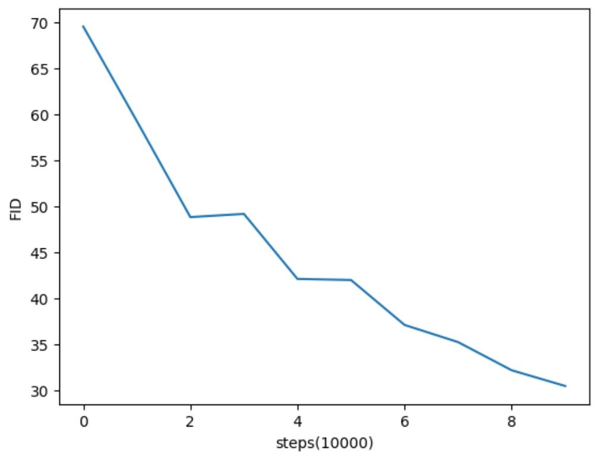
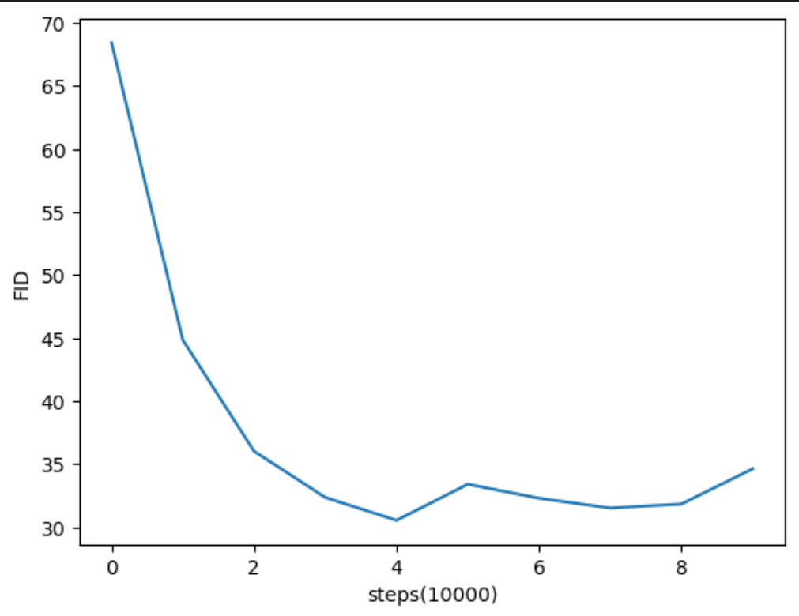
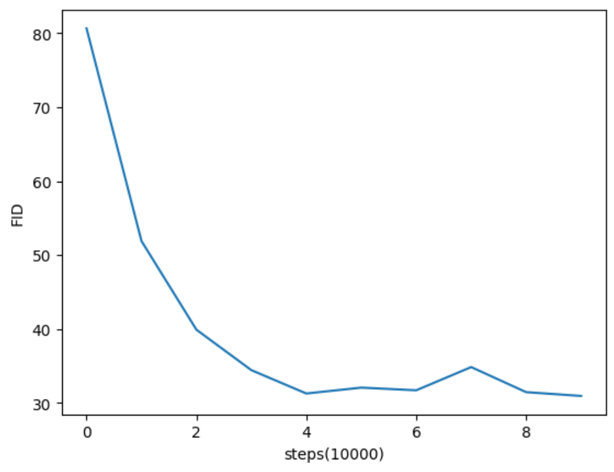
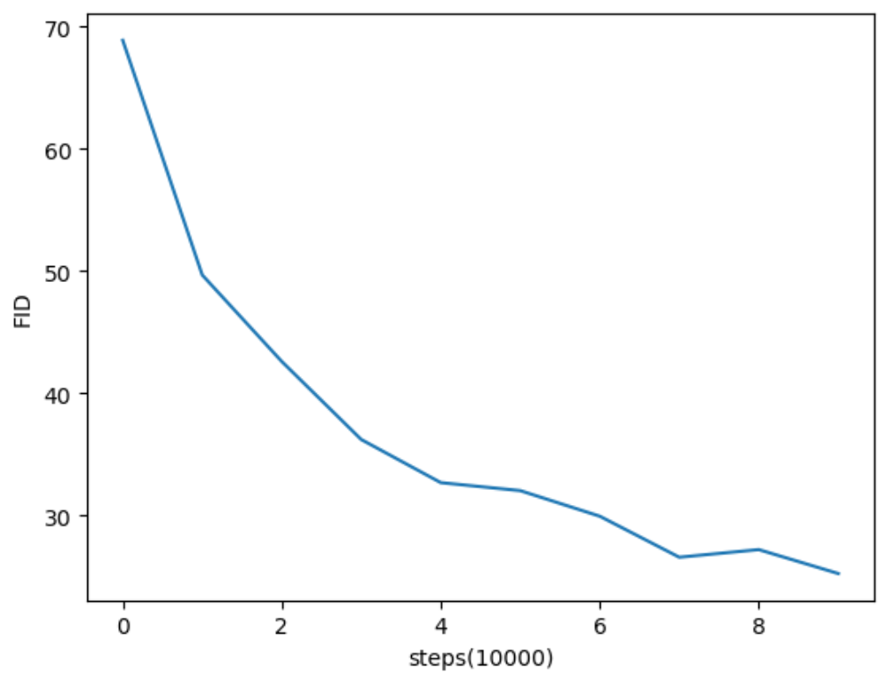
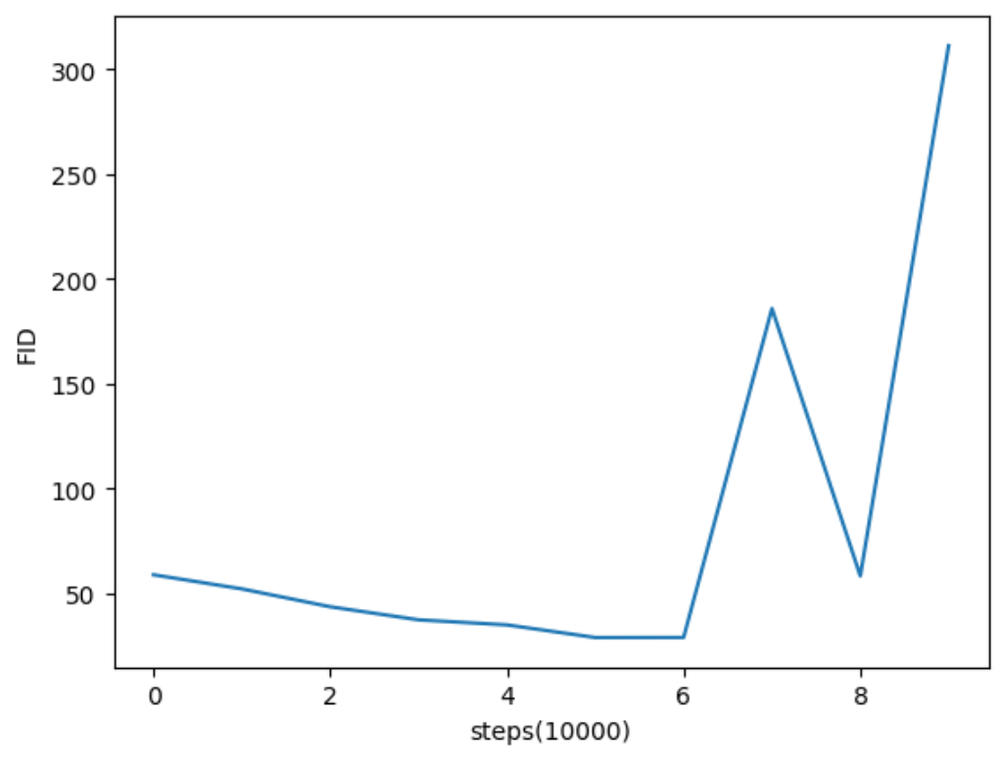

# Non-local Self-Attention GAN

## Prerequisites

* [Python 3.5+](https://www.continuum.io/downloads)
* [PyTorch 0.3.0+](http://pytorch.org/)

&nbsp;

## Usage

#### 1. Clone the repository

```bash
$ git clone https://github.com/zhengs81/SAGAN_PyTorch.git
$ cd SAGAN_PyTorch
```

#### 2. Install datasets (CelebA or LSUN)

```
https://www.kaggle.com/datasets/jessicali9530/celeba-dataset
or
https://www.kaggle.com/datasets/ajaykgp12/lsunchurch
```

Then move it under data/CelebA

#### 3. Train 

##### (i) Train with original SAGAN

```bash
$ python main.py --batch_size 64 --imsize 64 --dataset celeb --adv_loss hinge --version sagan_celeb --total_step 100000 --span 0
```

##### (ii) Train with Non-local SAGAN

```bash
$ python main.py --batch_size 64 --imsize 64 --dataset celeb --adv_loss hinge --version sagan_celeb --total_step 100000 --span 3
```

#### 4. Enjoy the results

```bash
$ cd sparse_samples_3
```


# Experiments

## Key Idea

We add the feature to use non-local attention instead of full attention algorithm. Specifically, we set the attention after softmax in a local of span x span square to be 0, which means don't allow a pixel to attend to its neighbors, because we believe convolution is able to extract local features efficiently, and attention to neighoring pixels could result in little attention allocated to long-distance pixels.

## Results
### FID of SAGAN on CelebA
<p align="center"></p>

### FID of Non-local SAGAN(span=1) on CelebA 
<p align="center"></p>

### FID of Non-local SAGAN(span=2) on CelebA 
<p align="center"></p>

### FID of Non-local SAGAN(span=3) on CelebA 
<p align="center"></p>

### FID of Non-local SAGAN(span=4) on CelebA 
<p align="center"></p>


## Conclusion

1. Non-local SAGAN converges much faster than SAGAN. We find that SAGAN converges at about 300000 steps(as shown in Figure 2) and Non-local SAGAN converges within about 80000 steps(as shown in Figure 3,4,5). This means that our model has achieved about 3.75x speed improvement.
2. Our model is on par with SAGAN and even performs better when span equals 3. The baseline(SAGAN) FID is 30.43, while Non-local SAGAN attains 25.25 at 100000 steps.
3. Mode collapse. In Non-local SAGAN(span=4), the mode collapse happens, even by using the combination of spectral normalization and imbalance learning rate. This might be due to excessively large non-local mask, which is 9*9 when span equals 4. This large span could prevent attention layers from capturing long-term dependencies that should be discovered otherwise, thus making the training process unstable.


# Reference

1. The paper of SAGAN: Zhang, Han, et al. "Self-attention generative adversarial networks." *International conference on machine learning*. PMLR, 2019.

2. cGAN which proposes spectral normalization on weights of discriminator: Miyato, Takeru, and Masanori Koyama. "cGANs with projection discriminator." *arXiv preprint arXiv:1802.05637* (2018).

3. Sparse Attention: Child, Rewon, et al. "Generating long sequences with sparse transformers." *arXiv preprint arXiv:1904.10509* (2019).

4. Residual blocks: He, Kaiming, et al. "Deep residual learning for image recognition." *Proceedings of the IEEE conference on computer vision and pattern recognition*. 2016.

5. Transformer: Vaswani, Ashish, et al. "Attention is all you need." *Advances in neural information processing systems* 30 (2017).

6. Formalization of self-attention as a non-local operation: Wang, Xiaolong, et al. "Non-local neural networks." *Proceedings of the IEEE conference on computer vision and pattern recognition*. 2018.

7. Reference Repositories：

   https://github.com/brain-research/self-attention-gan

​       https://github.com/heykeetae/Self-Attention-GAN

​       https://github.com/toshas/torch-fidelity/tree/master

​       https://github.com/mseitzer/pytorch-fid/tree/master
